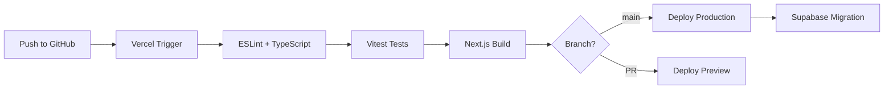

# WordQuest 技术架构设计文档

> **版本**: V1.0  
> **技术栈**: Next.js 14 + Supabase + Tailwind CSS  
> **部署平台**: Vercel + Supabase Cloud  
> **创建日期**: 2025-01-15

---

## 1. 技术栈概述

### 1.1 为什么选择这个组合？

| 技术 | 核心优势 |
|-----|---------|
| **Next.js 14** | App Router + Server Components，首屏极速加载；API Routes 实现全栈开发；Vercel 一键部署 |
| **Supabase** | 开箱即用的 PostgreSQL + Auth + Realtime + Storage；免费层足够 MVP；开源可自托管 |
| **Tailwind CSS** | 原子化 CSS，开发效率极高；与 Next.js 深度集成；打包体积小；设计系统一致性强 |

### 1.2 架构优势

- **开发效率**: 全栈 TypeScript，一个仓库搞定前后端
- **部署简单**: Vercel + Supabase，零运维成本
- **成本低**: Supabase 免费层 500MB 数据库 + 1GB 存储 + 50K MAU
- **实时能力**: Supabase Realtime 天然支持 PvP 对战
- **类型安全**: Supabase CLI 自动生成 TypeScript 类型

---

## 2. 系统架构

### 2.1 架构图

```
┌─────────────────────────────────────────────────────────────┐
│                        【客户端】                            │
│   Web (Next.js)  │  iOS (PWA/Capacitor)  │  Android (PWA)   │
└─────────────────────────────────────────────────────────────┘
                               ▼
┌─────────────────────────────────────────────────────────────┐
│                   【Vercel Edge Network】                    │
│     CDN (静态资源)  │  Edge Functions  │  Image Optimization │
└─────────────────────────────────────────────────────────────┘
                               ▼
┌─────────────────────────────────────────────────────────────┐
│                    【Next.js 应用层】                         │
│   Server Components  │  API Routes  │  Server Actions        │
└─────────────────────────────────────────────────────────────┘
                               ▼
┌─────────────────────────────────────────────────────────────┐
│                       【Supabase】                            │
│  PostgreSQL  │  Auth  │  Realtime  │  Storage  │  Edge Func  │
└─────────────────────────────────────────────────────────────┘
```

### 2.2 数据流向

1. **静态页面** → Vercel CDN 全球边缘节点直接返回
2. **Server Components** → 服务端渲染，直接查询 Supabase
3. **Client Components** → 调用 API Routes 或直连 Supabase Client
4. **实时对战** → Supabase Realtime (WebSocket) 双向通信

---

## 3. 技术选型详情

### 3.1 前端技术栈

| 类别 | 技术选型 | 说明 |
|-----|---------|-----|
| 框架 | Next.js 14 (App Router) | React Server Components，流式渲染，自动代码分割 |
| 语言 | TypeScript 5 | 类型安全，配合 Supabase 自动生成类型 |
| 样式 | Tailwind CSS 3.4 | 原子化 CSS，JIT 编译，暗色模式支持 |
| UI 组件 | shadcn/ui | 基于 Radix UI，可复制源码，完全可定制 |
| 动画 | Framer Motion | 声明式动画，手势支持，页面过渡 |
| 游戏引擎 | PixiJS 7 + React | 2D WebGL 渲染，@pixi/react 集成 |
| 状态管理 | Zustand | 轻量级，支持持久化，配合 React Query |
| 数据请求 | TanStack Query | 缓存、重试、乐观更新，配合 Supabase |
| 表单 | React Hook Form + Zod | 高性能表单，Schema 验证 |
| 音效 | Howler.js | 跨浏览器音频，精灵图支持 |
| 图标 | Lucide React | 轻量 SVG 图标库 |

### 3.2 后端技术栈 (Supabase)

| 服务 | Supabase 功能 | 用途 |
|-----|-------------|-----|
| 数据库 | PostgreSQL 15 | 主数据库，支持 RLS 行级安全，自动生成 REST API |
| 身份认证 | Supabase Auth | 邮箱/手机/OAuth 登录，JWT 令牌，支持家长-孩子关联 |
| 实时通信 | Supabase Realtime | WebSocket 订阅数据库变更，用于 PvP 对战和排行榜 |
| 文件存储 | Supabase Storage | 头像、音效、图片资源，支持 CDN 加速 |
| 边缘函数 | Edge Functions (Deno) | 复杂业务逻辑、AI 调用、定时任务 |
| 向量搜索 | pgvector 扩展 | 单词语义搜索、智能推荐（可选） |

### 3.3 开发工具链

| 类别 | 工具 | 用途 |
|-----|-----|-----|
| 包管理 | pnpm | 快速、节省磁盘空间 |
| 代码规范 | ESLint + Prettier | 代码质量和格式化 |
| Git Hooks | Husky + lint-staged | 提交前自动检查 |
| 测试 | Vitest + Testing Library | 单元测试和组件测试 |
| E2E 测试 | Playwright | 端到端自动化测试 |
| 类型生成 | Supabase CLI | 从数据库 Schema 生成 TypeScript 类型 |
| 本地开发 | Supabase Local | 本地 Docker 环境，完整功能模拟 |

---

## 4. 项目结构

```
wordquest/
├── app/                          # Next.js App Router
│   ├── (auth)/                   # 认证相关页面组
│   │   ├── login/page.tsx
│   │   └── register/page.tsx
│   ├── (main)/                   # 主应用页面组
│   │   ├── home/page.tsx         # 首页 (Server Component)
│   │   ├── dungeon/page.tsx      # 地下城 (Client Component)
│   │   ├── crossword/page.tsx    # 填词游戏
│   │   ├── farm/page.tsx         # 单词农场
│   │   ├── pvp/page.tsx          # PvP 对战 (Realtime)
│   │   └── layout.tsx            # 主布局（底部导航）
│   ├── api/                      # API Routes
│   │   ├── learning/route.ts     # 学习相关 API
│   │   └── game/route.ts         # 游戏相关 API
│   ├── layout.tsx                # 根布局
│   └── globals.css               # Tailwind 入口
├── components/                   # React 组件
│   ├── ui/                       # shadcn/ui 组件
│   ├── game/                     # 游戏专用组件
│   │   ├── Monster.tsx           # 怪物组件
│   │   ├── WordCard.tsx          # 单词卡片
│   │   ├── ComboCounter.tsx      # 连击计数器
│   │   └── ParticleEffect.tsx    # 粒子特效
│   └── shared/                   # 通用组件
│       ├── BottomNav.tsx         # 底部导航
│       └── UserAvatar.tsx        # 用户头像
├── lib/                          # 工具库
│   ├── supabase/                 # Supabase 客户端
│   │   ├── client.ts             # 浏览器端客户端
│   │   ├── server.ts             # 服务端客户端
│   │   └── middleware.ts         # Auth 中间件
│   ├── hooks/                    # 自定义 Hooks
│   │   ├── useUser.ts            # 用户状态
│   │   ├── useLearning.ts        # 学习逻辑
│   │   └── useRealtime.ts        # 实时订阅
│   ├── stores/                   # Zustand 状态
│   │   ├── gameStore.ts          # 游戏状态
│   │   └── userStore.ts          # 用户状态
│   └── utils/                    # 工具函数
│       ├── spaced-repetition.ts  # 间隔重复算法
│       └── sound.ts              # 音效管理
├── types/                        # TypeScript 类型
│   └── supabase.ts               # Supabase 自动生成
├── supabase/                     # Supabase 配置
│   ├── migrations/               # 数据库迁移
│   │   ├── 001_init.sql
│   │   ├── 002_words.sql
│   │   └── 003_game_progress.sql
│   ├── functions/                # Edge Functions
│   │   ├── process-answer/
│   │   └── daily-reset/
│   └── seed.sql                  # 初始数据
├── public/                       # 静态资源
│   ├── sounds/                   # 音效文件
│   └── images/                   # 图片资源
├── tailwind.config.ts            # Tailwind 配置
├── next.config.js                # Next.js 配置
└── package.json
```

---

## 5. 数据库设计

### 5.1 ER 图概览

```
┌──────────────┐     ┌──────────────┐     ┌──────────────┐
│   profiles   │     │    words     │     │  wordbooks   │
├──────────────┤     ├──────────────┤     ├──────────────┤
│ id (PK, FK)  │     │ id (PK)      │     │ id (PK)      │
│ username     │     │ word         │     │ name         │
│ avatar_url   │     │ meaning      │     │ description  │
│ level        │     │ pronunciation│     │ word_count   │
│ exp          │     │ audio_url    │     │ difficulty   │
│ gold         │     │ image_url    │     └──────────────┘
│ streak_days  │     │ example      │            │
│ is_child     │     │ difficulty   │            │
│ parent_id    │     │ wordbook_id ─┼────────────┘
│ daily_limit  │     └──────────────┘
└──────────────┘            │
       │                    │
       │     ┌──────────────┴───────────────┐
       │     │                              │
       ▼     ▼                              ▼
┌──────────────────────┐         ┌──────────────────────┐
│  learning_records    │         │   game_progress      │
├──────────────────────┤         ├──────────────────────┤
│ id (PK)              │         │ user_id (PK, FK)     │
│ user_id (FK)         │         │ dungeon_floor        │
│ word_id (FK)         │         │ max_combo            │
│ memory_strength      │         │ farm_plants (JSONB)  │
│ review_count         │         │ pvp_rating           │
│ correct_count        │         │ achievements (JSONB) │
│ next_review_at       │         └──────────────────────┘
│ status               │
└──────────────────────┘
```

### 5.2 核心表结构

#### 5.2.1 用户表 (profiles)

> 扩展 Supabase Auth 的 `auth.users` 表

| 字段名 | 类型 | 约束 | 说明 |
|-------|-----|-----|-----|
| `id` | UUID | PK, FK→auth.users | 关联 Supabase Auth |
| `username` | TEXT | UNIQUE | 用户昵称 |
| `avatar_url` | TEXT | - | 头像（Supabase Storage） |
| `level` | INT | DEFAULT 1 | 用户等级 |
| `exp` | INT | DEFAULT 0 | 经验值 |
| `gold` | INT | DEFAULT 100 | 金币 |
| `streak_days` | INT | DEFAULT 0 | 连续学习天数 |
| `is_child` | BOOLEAN | DEFAULT false | 是否少儿账号 |
| `parent_id` | UUID | FK→profiles | 家长账号 ID |
| `daily_limit` | INT | DEFAULT 60 | 每日学习限制（分钟） |
| `created_at` | TIMESTAMPTZ | DEFAULT now() | 创建时间 |

#### 5.2.2 单词表 (words)

| 字段名 | 类型 | 约束 | 说明 |
|-------|-----|-----|-----|
| `id` | UUID | PK | 单词 ID |
| `word` | TEXT | UNIQUE, INDEX | 英文单词 |
| `meaning` | TEXT | NOT NULL | 中文释义 |
| `pronunciation` | TEXT | - | 音标 |
| `audio_url` | TEXT | - | 发音音频 URL |
| `image_url` | TEXT | - | 配图 URL（少儿模式） |
| `example` | TEXT | - | 例句 |
| `difficulty` | INT | 1-5 | 难度等级 |
| `wordbook_id` | UUID | FK, INDEX | 所属词库 |

#### 5.2.3 学习记录表 (learning_records)

| 字段名 | 类型 | 约束 | 说明 |
|-------|-----|-----|-----|
| `id` | UUID | PK | 记录 ID |
| `user_id` | UUID | FK, INDEX | 用户 ID |
| `word_id` | UUID | FK, INDEX | 单词 ID |
| `memory_strength` | FLOAT | 0-1 | 记忆强度 |
| `review_count` | INT | DEFAULT 0 | 复习次数 |
| `correct_count` | INT | DEFAULT 0 | 答对次数 |
| `next_review_at` | TIMESTAMPTZ | INDEX | 下次复习时间 |
| `status` | TEXT | - | learning / reviewing / mastered |

#### 5.2.4 游戏进度表 (game_progress)

| 字段名 | 类型 | 约束 | 说明 |
|-------|-----|-----|-----|
| `user_id` | UUID | PK, FK | 用户 ID（一对一） |
| `dungeon_floor` | INT | DEFAULT 1 | 地下城层数 |
| `max_combo` | INT | DEFAULT 0 | 最高连击 |
| `farm_plants` | JSONB | - | 农场植物状态 |
| `pvp_rating` | INT | DEFAULT 1000 | PvP 段位分 |
| `achievements` | JSONB | DEFAULT '[]' | 已解锁成就 |

### 5.3 Row Level Security (RLS) 策略

```sql
-- profiles 表：用户只能读写自己的资料
CREATE POLICY "Users can view own profile"
  ON profiles FOR SELECT
  USING (auth.uid() = id);

CREATE POLICY "Users can update own profile"
  ON profiles FOR UPDATE
  USING (auth.uid() = id);

-- learning_records 表：用户只能访问自己的学习记录
CREATE POLICY "Users can CRUD own records"
  ON learning_records FOR ALL
  USING (auth.uid() = user_id);

-- 家长可以查看孩子的学习记录
CREATE POLICY "Parents can view child records"
  ON learning_records FOR SELECT
  USING (
    user_id IN (
      SELECT id FROM profiles WHERE parent_id = auth.uid()
    )
  );

-- words 表：所有已认证用户可读
CREATE POLICY "Authenticated users can read words"
  ON words FOR SELECT
  TO authenticated
  USING (true);
```

---

## 6. API 设计

### 6.1 API 策略

| 场景 | 方案 | 示例 |
|-----|-----|-----|
| 简单 CRUD | Supabase Client 直连 | `supabase.from('words').select()` |
| 需要服务端逻辑 | Next.js API Routes | `/api/game/attack` |
| 复杂事务 | Supabase Edge Functions | `supabase.functions.invoke('process-answer')` |
| 实时数据 | Supabase Realtime | `supabase.channel('pvp').subscribe()` |
| 定时任务 | Vercel Cron + Edge Function | 每日排行榜重置、复习提醒推送 |

### 6.2 核心 API Routes

| 方法 | 路径 | 说明 |
|-----|-----|-----|
| POST | `/api/learning/answer` | 提交答题结果，更新记忆强度，计算下次复习时间 |
| GET | `/api/learning/today` | 获取今日学习任务（智能算法推送） |
| POST | `/api/game/dungeon/attack` | 地下城攻击，处理伤害计算、连击、掉落 |
| POST | `/api/game/farm/water` | 浇水操作，触发植物成长 |
| POST | `/api/pvp/match` | 发起 PvP 匹配请求 |
| GET | `/api/parent/report` | 家长获取孩子学习报告 |

### 6.3 Supabase Realtime 频道

| 频道名 | 用途 | 事件类型 |
|-------|-----|---------|
| `pvp:room:{id}` | PvP 对战房间 | question, answer, result, leave |
| `rankings:daily` | 每日排行榜实时更新 | UPDATE on rankings table |
| `user:{id}:notify` | 用户消息通知 | achievement, friend_request, challenge |

### 6.4 API 示例代码

#### 提交答题结果

```typescript
// app/api/learning/answer/route.ts
import { createClient } from '@/lib/supabase/server'
import { calculateNextReview } from '@/lib/utils/spaced-repetition'

export async function POST(request: Request) {
  const supabase = createClient()
  const { wordId, isCorrect, responseTime } = await request.json()
  
  const { data: { user } } = await supabase.auth.getUser()
  if (!user) return Response.json({ error: 'Unauthorized' }, { status: 401 })

  // 获取当前学习记录
  const { data: record } = await supabase
    .from('learning_records')
    .select('*')
    .eq('user_id', user.id)
    .eq('word_id', wordId)
    .single()

  // 计算新的记忆强度和下次复习时间
  const newStrength = calculateMemoryStrength(record, isCorrect, responseTime)
  const nextReview = calculateNextReview(newStrength)

  // 更新记录
  const { data, error } = await supabase
    .from('learning_records')
    .upsert({
      user_id: user.id,
      word_id: wordId,
      memory_strength: newStrength,
      review_count: (record?.review_count || 0) + 1,
      correct_count: (record?.correct_count || 0) + (isCorrect ? 1 : 0),
      next_review_at: nextReview,
      status: newStrength > 0.8 ? 'mastered' : 'reviewing'
    })

  return Response.json({ success: true, newStrength, nextReview })
}
```

---

## 7. 认证与安全

### 7.1 Supabase Auth 配置

| 认证方式 | 配置说明 |
|---------|---------|
| 邮箱密码 | 启用邮箱验证，密码最少 8 位 |
| 手机号 OTP | 接入 Twilio/阿里云短信，验证码登录 |
| 微信登录 | OAuth 2.0，通过自定义 Provider 接入 |
| 家长账号 | 注册时可选「我是家长」，绑定孩子账号 |
| 少儿账号 | 需家长手机验证后创建，默认限制社交功能 |

### 7.2 安全措施

- **全站 HTTPS**: Vercel 自动配置 SSL
- **RLS 行级安全**: 数据库层面隔离用户数据
- **JWT 短期令牌**: Access Token 1 小时过期，Refresh Token 7 天
- **API 限流**: Vercel Edge Middleware 实现，100 次/分钟/IP
- **输入验证**: Zod Schema 验证所有用户输入
- **COPPA 合规**: 少儿账号数据最小化采集，家长可随时删除

### 7.3 中间件配置

```typescript
// middleware.ts
import { createMiddlewareClient } from '@supabase/auth-helpers-nextjs'
import { NextResponse } from 'next/server'
import type { NextRequest } from 'next/server'

export async function middleware(req: NextRequest) {
  const res = NextResponse.next()
  const supabase = createMiddlewareClient({ req, res })
  
  const { data: { session } } = await supabase.auth.getSession()

  // 未登录用户重定向到登录页
  if (!session && req.nextUrl.pathname.startsWith('/app')) {
    return NextResponse.redirect(new URL('/login', req.url))
  }

  return res
}

export const config = {
  matcher: ['/app/:path*', '/api/:path*']
}
```

---

## 8. 部署方案

### 8.1 部署架构

| 服务 | 平台 | 说明 |
|-----|-----|-----|
| Next.js 应用 | **Vercel** | 自动 CI/CD，全球 CDN，Edge Functions |
| 数据库 + Auth | **Supabase** | 托管 PostgreSQL，免费层 500MB |
| 文件存储 | **Supabase Storage** | 头像、音效资源，1GB 免费 |
| 域名 DNS | Cloudflare | 免费 DNS，DDoS 防护 |
| 监控 | Vercel Analytics | Web Vitals，用户行为分析 |
| 错误追踪 | Sentry | 错误捕获，性能监控 |

### 8.2 环境配置

| 环境 | 域名 | Supabase 项目 | 用途 |
|-----|-----|-------------|-----|
| 开发 | localhost:3000 | Local (Docker) | 本地开发 |
| 预览 | *.vercel.app | wordquest-dev | PR 预览 |
| 生产 | wordquest.com | wordquest-prod | 正式环境 |

### 8.3 环境变量

```bash
# .env.local
NEXT_PUBLIC_SUPABASE_URL=https://xxx.supabase.co
NEXT_PUBLIC_SUPABASE_ANON_KEY=eyJhbG...
SUPABASE_SERVICE_ROLE_KEY=eyJhbG...  # 仅服务端使用
SENTRY_DSN=https://xxx@sentry.io/xxx
```

### 8.4 CI/CD 流程



---

## 9. 性能优化

| 优化点 | 实施方案 |
|-------|---------|
| 首屏加载 | Server Components 减少客户端 JS；Route Groups 按需加载 |
| 图片优化 | next/image 自动 WebP 转换、懒加载、响应式 |
| 字体优化 | next/font 本地字体，避免 FOIT/FOUT |
| 数据缓存 | TanStack Query 缓存 + Supabase 实时更新失效 |
| 数据库查询 | 合理建立索引；复杂查询使用 Database Functions |
| 游戏性能 | PixiJS 对象池复用；requestAnimationFrame 节流 |
| Bundle 体积 | 动态导入游戏模块；Tree Shaking；Tailwind Purge |

### 9.1 性能指标目标

| 指标 | 目标值 |
|-----|-------|
| LCP (Largest Contentful Paint) | < 2.5s |
| FID (First Input Delay) | < 100ms |
| CLS (Cumulative Layout Shift) | < 0.1 |
| TTI (Time to Interactive) | < 3.5s |
| API 响应时间 P99 | < 200ms |

---

## 10. 成本估算

### 10.1 免费层覆盖范围

| 服务 | 免费额度 | 预计可支撑 |
|-----|---------|----------|
| Vercel Hobby | 100GB 带宽/月，无限部署 | ~10,000 DAU |
| Supabase Free | 500MB 数据库，1GB 存储，50K MAU | ~5,000 DAU |
| Supabase Realtime | 200 并发连接 | ~50 同时对战 |

### 10.2 扩展成本（按需）

| 服务 | 套餐 | 月费用 | 提升能力 |
|-----|-----|-------|---------|
| Vercel Pro | Team | $20/人 | 1TB 带宽，团队协作 |
| Supabase Pro | Pro | $25 起 | 8GB 数据库，100K MAU |
| Sentry | Team | $26/月 | 100K 错误/月 |

### 10.3 阶段成本预估

| 阶段 | 月成本 | 支撑规模 |
|-----|-------|---------|
| MVP 验证 | **$0** | ~5,000 DAU |
| 早期增长 | ~$50 | ~30,000 DAU |
| 规模化 | ~$200 | ~100,000 DAU |

---

## 11. 开发路线

| 阶段 | 时间 | 交付内容 |
|-----|-----|---------|
| Week 1-2 | 项目搭建 | Next.js + Supabase + Tailwind 脚手架；数据库 Schema；Auth 集成 |
| Week 3-4 | 核心功能 | 首页 UI；单词学习流程；答题反馈；基础 API |
| Week 5-6 | 游戏模块 | 单词地下城（PixiJS）；连击系统；填词游戏 |
| Week 7-8 | 养成 & 社交 | 单词农场；成就系统；排行榜（Realtime） |
| Week 9-10 | 少儿模式 | 家长监护；少儿 UI 皮肤；学习时长控制 |
| Week 11-12 | PvP & 优化 | PvP 对战（Realtime）；性能优化；测试；上线 |

---

## 12. 监控与日志

### 12.1 监控指标

| 监控类型 | 关键指标 | 告警阈值 |
|---------|---------|---------|
| 应用性能 | API 响应时间 P99 | > 500ms 告警 |
| 应用性能 | 错误率 (5xx) | > 1% 告警 |
| 用户体验 | Web Vitals (LCP/FID/CLS) | 超出 Good 阈值 |
| 数据库 | 连接数 | > 80% 最大连接数 |
| 实时服务 | WebSocket 连接数 | > 180 并发告警 |

### 12.2 日志方案

- **应用日志**: Vercel Logs（14天保留）
- **错误追踪**: Sentry（堆栈追踪、用户上下文）
- **性能监控**: Vercel Analytics + Sentry Performance
- **数据库日志**: Supabase Dashboard（慢查询分析）

---

## 附录

### A. 常用命令

```bash
# 本地开发
pnpm dev                    # 启动 Next.js
pnpm supabase start         # 启动本地 Supabase
pnpm supabase db reset      # 重置数据库

# 类型生成
pnpm supabase gen types typescript --local > types/supabase.ts

# 数据库迁移
pnpm supabase db diff -f migration_name  # 生成迁移
pnpm supabase db push                     # 应用迁移

# 部署
git push origin main        # 自动触发 Vercel 部署
```

### B. 参考资源

- [Next.js 14 文档](https://nextjs.org/docs)
- [Supabase 文档](https://supabase.com/docs)
- [Tailwind CSS 文档](https://tailwindcss.com/docs)
- [shadcn/ui 组件](https://ui.shadcn.com)
- [PixiJS 文档](https://pixijs.com/guides)

### C. 更新日志

| 版本 | 日期 | 更新内容 |
|-----|-----|---------|
| V1.0 | 2025-01-15 | 初始版本，Next.js + Supabase 架构 |

---

*文档结束*
